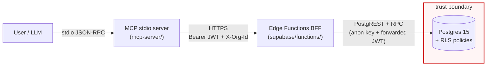

# cohort-lens

A vertical slice of a multi-tenant marketing-analytics platform. Postgres
(Supabase) with RLS is the source of truth; a Deno Edge Functions BFF sits on
top; a stdio MCP server wraps the BFF so an LLM can answer natural-language
questions like *"which creatives are ready to scale in Germany?"* without ever
seeing another tenant's data. Built as an interview artifact — small,
complete, defensible under questioning.

## Architecture



**The trust boundary is the DB, not the BFF.** The BFF never uses a
privileged key; every request forwards the caller's JWT so RLS policies
decide what's visible. The BFF also validates `X-Org-Id` against
`org_members` to return an explicit `403 org_forbidden` — belt-and-braces —
but even if you bypassed that check, RLS would still reject cross-tenant
reads at the DB layer.

## Stack

| Layer            | Tech                                                                  |
|------------------|-----------------------------------------------------------------------|
| DB               | Supabase local (Docker), Postgres 15                                  |
| Migrations       | Supabase SQL migrations (`supabase/migrations/`)                      |
| BFF              | Supabase Edge Functions (Deno, TS strict)                             |
| Validation       | Zod (bff + mcp)                                                       |
| MCP              | `@modelcontextprotocol/sdk` stdio, Node 20 + TS strict                |
| Tests            | Vitest (Node integration + unit)                                      |
| CI               | GitHub Actions with the full Supabase stack                           |
| Package manager  | pnpm 10, workspace                                                    |

## Quickstart

See [SETUP.md](SETUP.md) for a clean-machine walk-through. TL;DR once you
have `pnpm`, `docker`, `deno`, and the `supabase` CLI:

```bash
pnpm install
supabase start
pnpm db:reset && pnpm db:seed        # ~30s, seeds 1.97M cohort_daily rows
pnpm functions:serve                  # BFF on :54321/functions/v1
pnpm test                             # 43 tests, ~5s
pnpm bench                            # writes bench/results/bench.md
```

For the MCP server + Claude:

```bash
eval "$(node scripts/sign-mcp-jwt.mjs)"   # exports COHORT_LENS_URL/JWT/ORG_ID
pnpm mcp:inspect                          # opens MCP Inspector in the browser
```

## Benchmark (real numbers from a warm run on an M-series laptop)

Scenario: **90-day range, groupBy=[channel, country], dayIndex≤30**, org=`acme-games`, 25 iterations, first run discarded, `VACUUM ANALYZE` applied by the seeder.

| variant                                    | p50 (ms) | p95 (ms) | rows returned | approx bytes |
|--------------------------------------------|---------:|---------:|--------------:|-------------:|
| naive (SELECT rows → Node aggregate)       |     63.1 |     70.3 |        55,800 |     5,231 KB |
| optimised (`rpc_cohort_performance`)       |     79.7 |    116.9 |            20 |       3.9 KB |

The RPC path returns **~2,790× fewer rows over the wire**. On localhost the
p95 is comparable because 5 MB is essentially free — over a real VPC it is
not. The interesting piece is the SQL plan under both.

<details>
<summary><b>EXPLAIN (ANALYZE, BUFFERS) — before and after the hot-path covering index</b></summary>

**Before** (only the baseline `(org_id, cohort_date)` index — `0003_indexes.sql`):

```
Parallel Bitmap Heap Scan on cohort_daily cd
  Recheck Cond: ((org_id = ...) AND (cohort_date BETWEEN ...))
  Filter: (day_index <= 30)
  Rows Removed by Filter: 36000
  Heap Blocks: exact=755
  Buffers: shared hit=2539
  -> Bitmap Index Scan on cohort_daily_org_date_idx
        actual time=2.787..2.788 rows=163800 loops=1
Execution Time: 120.093 ms
```

**After** (`0006_hot_path_index.sql` adds
`(org_id, cohort_date, day_index) INCLUDE (campaign_id, country, installs, spend_micros, revenue_micros, currency)`):

```
Parallel Index Only Scan using cohort_daily_hot_path_idx on cohort_daily cd
  Index Cond: ((org_id = ...) AND (cohort_date BETWEEN ...) AND (day_index <= 30))
  Heap Fetches: 0
  Buffers: shared hit=1889 read=1
Execution Time: 24.851 ms
```

Same query, **~5× faster** (120 ms → 25 ms) with `Heap Fetches: 0` — a pure
index-only scan. Note the `day_index` predicate now prunes at the leaf level
instead of filtering ~36k rows in the recheck. Full plans:
[`bench/results/explain-before.txt`](bench/results/explain-before.txt),
[`bench/results/explain-after.txt`](bench/results/explain-after.txt).

</details>

## Decisions & trade-offs

| decision | alternative rejected | why | at 100× scale |
|---|---|---|---|
| **RLS as enforcement boundary** | app-layer filter in BFF | one place to audit, and it survives BFF bugs / bypassed middleware | still correct; scale of RLS overhead is negligible next to query cost |
| **BFF also validates `X-Org-Id`** | rely on RLS alone | RLS returns an empty result on a cross-tenant read — a 200 with `[]` is unclickable to debug; the BFF's 403 `org_forbidden` says *why* | same |
| **JWT forwarded, no privileged key in BFF** | use `service_role` + validate `org_id` server-side | privileged keys are a bug away from a data breach; forwarding keeps RLS on the hot path (a grep test enforces it) | same; would add a proxy that mints scoped tokens for admin ops |
| **Money as `bigint` micros in source currency** | `numeric(20, 4)` in USD at write time | eliminates float error at the source of truth; centralises the FX-rate join to one place | unchanged; USD rounding stays at read time |
| **Hand-written SQL, no ORM** | Prisma / Drizzle / Kysely | the hot query is a SQL RPC using `EXPLAIN`-tunable dynamic SQL — ORMs abstract away the primitives (`INCLUDE`, `NULLS NOT DISTINCT`, `SECURITY INVOKER`) you need to reason about safely | same; ORM cost gets worse, not better, as aggregations get gnarlier |
| **Deno Edge Functions for the BFF** | Node + Express, or a monolith | small serverless units, TypeScript strict, native `fetch` and `Deno.serve` with zero framework; sits naturally next to Supabase Auth | keep them, plus a CDN cache in front for hot GETs |
| **Server-side aggregation via SQL RPCs** | pull rows and aggregate in TS | 2,790× fewer rows over the wire; SQL planner + index-only scan; consistency across callers | pre-aggregate into a materialised rollup table and hit that instead |
| **Cursor pagination on `/campaigns`** | offset pagination | offset gets slower per page as the offset grows; cursor is O(1) with the PK index | required — offset would be unusable at real campaign counts |
| **`UNIQUE NULLS NOT DISTINCT` on `cohort_daily` natural key, no synthetic PK** | sentinel UUID for "no creative" | preserves NULL as first-class + still deduplicates; no join gymnastics against a magic id | unchanged — the constraint is a b-tree; adds no cost |
| **Aggregation lives in the DB, weights in TS (`score_creatives`)** | either put weights in SQL or move both to TS | keeps auditable SQL for benchmark computation and a unit-testable TS function for the weighted score; changing weights doesn't require a migration | still true; add a config table if weights should be per-org |
| **No caching layer in this slice** | Redis / edge cache | premature — cache invalidation is a real design problem I'd rather solve once the read patterns are known, not up-front | add ETag/Cache-Control on `GET /campaigns` first; then a Redis rollup cache in front of the RPC keyed by (org_id, request-hash) with a 60s TTL |
| **`VACUUM ANALYZE` runs at end of seed** | trust autovacuum | fresh reset would give inaccurate planner stats and a cold visibility map; benchmark numbers would move by 2-3× between runs for no reason | not needed — real workloads keep the stats hot |

## What I'd do next

1. **Caching layer.** ETag on `/campaigns`; a Redis rollup keyed by
   `(org_id, hash(request))` with a 60s TTL in front of
   `rpc_cohort_performance`. Invalidation on ingestion events (Supabase
   Realtime is convenient here).
2. **Materialised cohort rollups.** A `cohort_rollup_daily` table populated
   incrementally by an hourly job. Reduces the hot-path query to a range
   scan on already-aggregated rows; RPCs stay the same on the read side.
3. **Streaming for large exports.** `/cohort-performance-export` returning
   NDJSON so a 500k-row export doesn't buffer in memory. Deno's streaming
   `Response` body makes this a small change.
4. **OAuth for the MCP server.** Right now `COHORT_LENS_JWT` is a static
   token — fine for local dev, wrong for anything user-facing. MCP has
   auth flows; wire in the OAuth 2.1 device flow so each session mints a
   short-lived, org-scoped token.
5. **Observability.** OpenTelemetry traces at the BFF layer: one span per
   endpoint with `db.ms` / `total.ms` (currently in `Server-Timing` only);
   structured error logs with the `error.code` from the envelope; a small
   Grafana board (or Supabase Logs saved queries) for p95 by endpoint.

## Demo

See [DEMO.md](DEMO.md) for a 90-second walkthrough that (1) breaks a live
RLS policy and watches the isolation suite fail, (2) shows the benchmark
table, (3) points Claude at the MCP server and asks
*"which creatives are ready to scale in Germany?"*.

## Repo layout

```
supabase/
  migrations/    0001 schema · 0002 rls-enable · 0003 baseline idx
                 0004 policies · 0005 rpcs · 0006 hot-path idx
  seed/          deterministic --seed 42, COPY-based
  functions/
    _shared/     auth · db · errors · currency · timezone · scoring · schemas
    cohort-performance/  cohort-compare/  creative-score/  campaigns/
mcp-server/
  src/           client · tools/ · resources/ · index (stdio)
bench/           naive-vs-optimised harness + captured results
tests/           43 tests: rls · rls-403 · contract · connector · mcp-client · units
demo/            break-policy.sql / restore-policy.sql / broken-policy.patch
scripts/         sign-mcp-jwt.mjs
```

## License

MIT.
